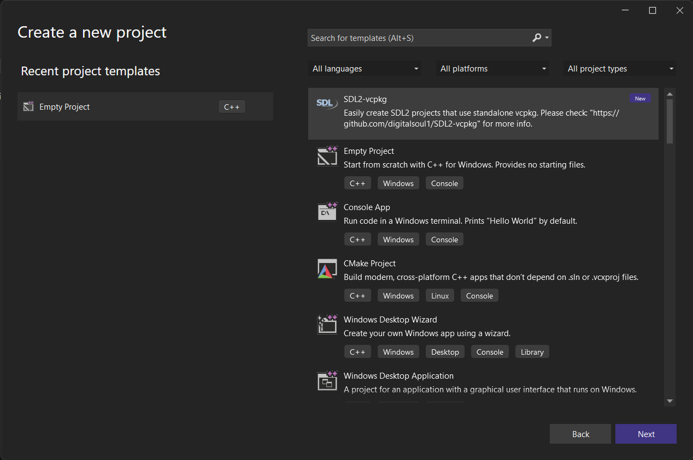

# DESCRIPTION
This repo contains a template that enables Visual Studio users to quickly start fresh SDL2 projects without the need of setting custom library directories or linked libraries.

This template assumes that the user is on a x64-windows host triplet and that the vcpkg is installed manually - not via Visual Studio Installer.

The template is distributed under GPL3.

# Getting Started
Install vcpkg from github:

* Clone vcpkg to a directory of your choice with:

    ```
    git clone https://github.com/Microsoft/vcpkg.git
    ```
* Boostrap vcpkg
    ```
    .\vcpkg\bootstrap-vcpkg.bat
    ```


* Add vcpkg directory to PATH to make things easier
* Set the VCPKG_DEFAULT_TRIPLET environment variable to 
    ```
    x64-windows
    ```
    Restart your PowerShell
* Enable integreation with Visual Studio / MSBuild
    ```
    vcpkg integrate install
    ```
* Install SDL2
    ```
    vcpkg install sdl2
    ```

# Install the template
* Go to Tools->Options->Projects and Solutions->Locations
* Note the directory for "User project template location"
* Go to that folder and clone the template repository with
    ```
    git clone https://github.com/digitalsoul1/SDL2-vcpkg.git
    ```
* Open Visual Studio and select SDL2 project

* The project template contains a main.cpp with a very basic SDL2 application. Build the solution to see if it works. You should see an 800x600 window for about 3 seconds before it closes.


    
